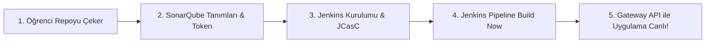

# Google Online Boutique — Cloud-Native CI/CD & Traefik v3 Gateway API Platform

Bu proje, Google Cloud'un mikroservis mimarisine sahip **Online Boutique** referans e-ticaret uygulamasının; klasik Ingress yerine yeni nesil **Kubernetes Gateway API (Traefik v3)** ile dış dünyaya açıldığı, **Jenkins as Code (JCasC)** ve **SonarQube** entegrasyonuyla otomatik derlenip dağıtıldığı kurumsal bir DevOps laboratuvarıdır.

---

## 🏛️ Öğrenci Ortamı & Canlı Servis Portalı

Laboratuvarda her öğrenci için tanımlanan standart alt alan adları (`student<ID>`):

| Servis Adı | Açıklama | Canlı Erişim URL (Örnek: student100) |
|---|---|---|
| **Cockpit Web Terminal** | Linux ortam yönetimi ve web terminali | `https://student100-cockpit.devopsatolyesi.com` |
| **Jenkins CI/CD** | JCasC ile yapılandırılmış dağıtım hattı | `https://student100-jenkins.devopsatolyesi.com` |
| **SonarQube** | Statik kod kalitesi ve güvenlik kapısı | `https://student100-sonarqube.devopsatolyesi.com` |
| **Harbor Registry** | Güvenli OCI konteyner imaj deposu | `https://student100-harbor.devopsatolyesi.com` |
| **E-Commerce Storefront** | Gateway API üzerinden canlı uygulama | `https://student100-app1.devopsatolyesi.com` |

---

## 🎯 Adım Adım Öğrenci Laboratuvar Akışı

Bu laboratuvarda uygulama kümeye statik olarak kurulmaz; öğrenci Jenkins üzerinde CI/CD boru hattını çalıştırarak uygulamanın derlenmesini, SonarQube'dan geçmesini ve Gateway API ile canlıya alınmasını sağlar.



---

### Adım 1: Projeyi Klonlama

Cockpit terminalinize (`student` kullanıcısı ile) giriş yapın ve herkese açık (public) repoyu klonlayın:

```bash
git clone https://github.com/devopsatolyesi-labs/ecommerce-kind-gateway-cicd.git
cd ecommerce-kind-gateway-cicd
```

---

### Adım 2: SonarQube (v10 Community) Başlatma & PAT Token Oluşturma

1. SonarQube konteynerini (Güncel kararlı **SonarQube 10-Community**) başlatın:
```bash
sudo sysctl -w vm.max_map_count=262144
sudo docker network create training-net 2>/dev/null || true

sudo docker run -d \
    --name training-sonarqube \
    --network training-net \
    --restart unless-stopped \
    -p 127.0.0.1:19000:9000 \
    -e SONAR_ES_BOOTSTRAP_CHECKS_DISABLE=true \
    sonarqube:10-community
```

2. Tarayıcınızda SonarQube panelini açın:
   * **URL:** `https://student<ID>-sonarqube.devopsatolyesi.com`
   * **Kullanıcı:** `admin` | **Şifre:** `admin` (Yeni şifre belirleyin, örn: `BilgincIT454`)

3. Proje oluşturun ve Jenkins için erişim belirteci (PAT) üretin:
> **Hızlı CLI Komutu:**
> ```bash
> # Şifre değiştirme
> curl -s -u admin:admin -X POST 'http://127.0.0.1:19000/api/users/change_password?login=admin&previousPassword=admin&password=BilgincIT454'
>
> # Proje oluşturma
> curl -s -u admin:BilgincIT454 -X POST 'http://127.0.0.1:19000/api/projects/create?name=Online+Boutique&project=online-boutique-frontend'
>
> # Token üretme
> curl -s -u admin:BilgincIT454 -X POST 'http://127.0.0.1:19000/api/user_tokens/generate?name=jenkins-ci-token'
> ```

---

---

### Adım 3: Harbor OCI Registry ile Tanışma

Laboratuvar ortamında kurumsal bir özel imaj deposu (Registry) hazır olarak çalışır:
* **URL:** `https://student<ID>-harbor.devopsatolyesi.com`
* **Kullanıcı:** `admin` | **Şifre:** `BilgincIT454`
* **Hazır Proje:** `ecommerce` (Public)

Jenkins derlediği frontend imajını hem bu Harbor deposuna etiketleyip push eder, hem de yerel Kind kümesine yükler.

---

### Adım 4: Jenkins as Code (JCasC) ile Jenkins'i Başlatma

Jenkins'in eklentilerle, hazır pipeline işiyle (`Online-Boutique-Gateway-CI-CD`), Harbor ve SonarQube kimlik bilgileriyle kurulum sihirbazına gerek kalmadan ayağa kalkması için:

```bash
# 1. JCasC Jenkins imajını derleyin (Kubectl, Docker CLI, SonarScanner dahil)
sudo docker build -t ecommerce-jenkins:latest jenkins-as-code/

# 2. Kind kümesi erişimi için kubeconfig'i hazırlayın
sudo mkdir -p /var/jenkins_home/casc_configs /var/jenkins_home/.kube
sudo kind get kubeconfig --internal --name ecommerce-kind-cluster | sudo tee /var/jenkins_home/.kube/config >/dev/null
sudo cp jenkins-as-code/jenkins.yaml /var/jenkins_home/casc_configs/jenkins.yaml
sudo chown -R 1000:1000 /var/jenkins_home

# 3. Jenkins konteynerini çalıştırın
sudo docker run -d \
    --name training-jenkins \
    --restart unless-stopped \
    -p 127.0.0.1:18080:8080 \
    -p 127.0.0.1:50000:50000 \
    -e CASC_JENKINS_CONFIG=/var/jenkins_home/casc_configs/jenkins.yaml \
    -e SONAR_TOKEN="<SONARQUBE_TOKEN>" \
    -e SONAR_HOST_URL="http://training-sonarqube:9000" \
    -v /var/jenkins_home:/var/jenkins_home \
    -v /var/run/docker.sock:/var/run/docker.sock \
    ecommerce-jenkins:latest

# 4. Jenkins'i 'kind' ve 'training-net' ağlarına bağlayın
sudo docker network connect kind training-jenkins
sudo docker network connect training-net training-jenkins
```

---

### Adım 5: Jenkins Pipeline'ını Çalıştırma

1. Tarayıcınızda Jenkins'e giriş yapın:
   * **URL:** `https://student<ID>-jenkins.devopsatolyesi.com`
   * **Kullanıcı:** `admin` (veya `student`) | **Şifre:** `BilgincIT454`
2. Dashboard'da hazır bekleyen **`Online-Boutique-Gateway-CI-CD`** işine tıklayın.
3. Sol menüden **"Build Now"** butonuna basın.

---

### Adım 6: Pipeline Aşamalarını İzleme

Pipeline şu 8 aşamayı sırasıyla icra eder:

1. **1. Checkout SCM:** GitHub'daki açık kaynak repodan son kodları çeker.
2. **2. Unit Tests & Code Coverage:** Go birim testlerini çalıştırır.
3. **3. SonarQube Code Quality Gate:** `sonar-scanner` ile statik kod analizini `http://training-sonarqube:9000` adresine gönderir ve kalite denetimini tamamlar.
4. **4. Docker Multi-Stage Build:** `src/frontend` için optimize edilmiş konteyner imajını üretir.
5. **5. Container Security Scan (Trivy):** Üretilen imajı güvenlik açıkları (CVE) için tarar.
6. **6. Harbor Registry Push & Kind Load:** İmajı Harbor OCI deposuna (`student<ID>-harbor.../ecommerce/online-boutique-frontend`) push eder ve Kind kümesine aktarır.
7. **7. Deploy to Kubernetes (Gateway API):** Online Boutique mikroservislerini ve Traefik v3 `HTTPRoute` tanımlarını kümeye uygular.
8. **8. Automated Smoke Test:** Uçtan uca sağlık denetimi yapar.

---

### Adım 7: Canlı E-Ticaret Uygulamasını Doğrulama

Pipeline başarıyla tamamlandığında (`SUCCESS`), e-ticaret mağazanız Traefik Gateway API üzerinden Cloudflare ile güvenli (HTTPS) olarak yayına girer:

🌐 **Canlı Uygulama:** `https://student<ID>-app1.devopsatolyesi.com`

Tarayıcınızda açıp ürünleri sepete ekleyebilir, sipariş akışını test edebilirsiniz.

---

## 📊 Hangi Projede Hangi İzleme (Monitoring) Kullanılmalı?

DevOps eğitim programındaki 3 Capstone projesi arasında izleme araçları bilinçli olarak branşlaştırılmıştır:

| Proje | İzleme Aracı | Odak Noktası & Kullanım Nedeni |
|---|---|---|
| **Proje 1 (Bu Proje)** | **Prometheus + Grafana** | **Metrik Tabanlı İzleme:** Traefik Gateway API Ingress metrikleri, HTTP RPS, p95/p99 latency, Pod CPU/Bellek tüketimi. |
| **Proje 2** | **ELK Stack (Elasticsearch, Logstash, Kibana)** | **Merkezi Log Yönetimi & SIEM:** AWS üzerinde çalışan servislerin JSON loglarının toplanması, filtrelenmesi ve log analitiği. |
| **Proje 3** | **OpenTelemetry (OTel + Jaeger)** | **Dağıtık İzleme (Tracing) & SRE/SLO:** Mikroservisler arası RPC çağrı zincirleri, Span analizi, SLO & Hata Bütçesi takibi. |

---

## 🛠️ Sorun Giderme ve Komutlar

```bash
# Kind kümesindeki mikroservisleri listeleme
kubectl get pods,services,httproutes -n default

# Traefik Gateway durumunu kontrol etme
kubectl get gateway,gatewayclass -A

# Doğrulama scriptini elle çalıştırma
./scripts/validate.sh

# Jenkins loglarını anlık takip etme
sudo docker logs -f training-jenkins
```
