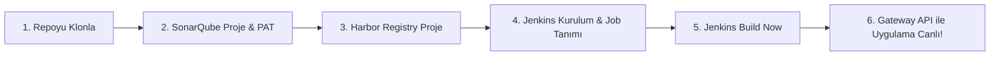

# Google Online Boutique — Cloud-Native CI/CD & Traefik v3 Gateway API Platform

Bu proje, Google Cloud'un mikroservis mimarisine sahip **Online Boutique** referans e-ticaret uygulamasının; klasik Ingress yerine yeni nesil **Kubernetes Gateway API (Traefik v3)** ile dış dünyaya açıldığı, **Jenkins as Code (JCasC)**, **SonarQube v10** ve **Harbor OCI Registry** entegrasyonuyla otomatik derlenip dağıtıldığı kurumsal bir DevOps laboratuvarıdır.

---

## 🏛️ Öğrenci Ortamı & Canlı Servis Portalı

Laboratuvarda her öğrenci için tanımlanan standart alt alan adları (`student<ID>`):

| Servis Adı | Açıklama | Canlı Erişim URL (Örnek: student100) | Varsayılan Kimlik Bilgileri |
|---|---|---|---|
| **Cockpit Web Terminal** | Linux ortam yönetimi ve web terminali | `https://student100-cockpit.devopsatolyesi.com` | `student` / `BilgincIT454` |
| **Jenkins CI/CD** | Dağıtım ve boru hattı otomasyonu (JDK 21) | `https://student100-jenkins.devopsatolyesi.com` | `admin` / `BilgincIT454` |
| **SonarQube** | Statik kod kalitesi ve güvenlik kapısı (v10) | `https://student100-sonarqube.devopsatolyesi.com` | `admin` / `BilgincIT454` |
| **Harbor Registry** | Özel OCI konteyner imaj deposu (v2.12) | `https://student100-harbor.devopsatolyesi.com` | `admin` / `BilgincIT454` |
| **Prometheus Monitoring** | Metrik toplama ve alarm kuralları | `https://student100-prometheus.devopsatolyesi.com` | Herkese Açık / Dahili |
| **Grafana Dashboards** | Gateway API panelleri ve görselleştirme | `https://student100-grafana.devopsatolyesi.com` | `admin` / `BilgincIT454` |
| **E-Commerce Storefront** | Gateway API üzerinden canlı mağaza | `https://student100-app1.devopsatolyesi.com` | Herkese Açık |

---

## 🎯 Adım Adım Öğrenci Laboratuvar Akışı

Bu laboratuvarda her işlem iki farklı yöntemle açıklanmıştır:
1. **Yol A (Web Arayüzü / Menüden):** Görsel olarak panelleri tıklayarak öğrenmek isteyenler için.
2. **Yol B (Komut Satırı / Kodla / API):** Hızlı, script edilebilir ve otomasyon odaklı ilerlemek isteyenler için.



---

### Adım 1: Projeyi Klonlama

Cockpit terminalinize (`student` kullanıcısı ile) bağlanın ve açık kaynak repoyu klonlayın:

```bash
git clone https://github.com/devopsatolyesi-labs/ecommerce-kind-gateway-cicd.git
cd ecommerce-kind-gateway-cicd
```

---

### Adım 2: SonarQube Başlatma, Proje Açma & PAT Token Alma

Önce SonarQube konteynerini başlatın:

```bash
sudo sysctl -w vm.max_map_count=262144
sudo docker network create training-net 2>/dev/null || true

sudo docker run -d \
    --name training-sonarqube \
    --network training-net \
    --restart unless-stopped \
    -p 127.0.0.1:19000:9000 \
    -e SONAR_ES_BOOTSTRAP_CHECKS_DISABLE=true \
    sonarqube:10-community
```

#### 🌐 Yol A: Web Menüsünden Yapılandırma
1. Tarayıcınızda açın: `https://student<ID>-sonarqube.devopsatolyesi.com`
2. `admin` / `admin` ile giriş yapın ve yeni şifrenizi belirleyin (Örn: `BilgincIT454`).
3. **Proje Oluşturma:**
   * Sağ üstteki **"+"** butonuna veya ana sayfadaki **"Create Project"** butonuna tıklayın ➔ **"Manually"** seçin.
   * **Project display name:** `Online Boutique`
   * **Project key:** `online-boutique-frontend`
   * **Main branch name:** `main` ➔ **Set Up** butonuna tıklayın.
4. **PAT (Personal Access Token) Üretme:**
   * Sağ üst köşedeki **Kullanıcı Profil İkonuna** tıklayın ➔ **My Account** seçin.
   * **Security** sekmesine geçin.
   * **Generate Token** kutucuğuna isim olarak `jenkins-ci-token` yazın, Type: `User Token`, Expires in: `30 days` seçin ve **Generate** butonuna basın.
   * Üretilen token'ı (Örn: `squ_bfa0de4cb...`) kopyalayın.

#### 💻 Yol B: Komut Satırı / API ile (Hızlı)
```bash
# Şifre güncelleme
curl -s -u admin:admin -X POST 'http://127.0.0.1:19000/api/users/change_password?login=admin&previousPassword=admin&password=BilgincIT454'

# Proje açma
curl -s -u admin:BilgincIT454 -X POST 'http://127.0.0.1:19000/api/projects/create?name=Online+Boutique&project=online-boutique-frontend'

# Token üretme (çıktıdaki "token" değerini not edin)
curl -s -u admin:BilgincIT454 -X POST 'http://127.0.0.1:19000/api/user_tokens/generate?name=jenkins-ci-token'
```

---

### Adım 3: Harbor OCI Registry Yapılandırması

Harbor sistemde kurulu ve `18082` portunda çalışmaktadır.

#### 🌐 Yol A: Web Menüsünden Yapılandırma
1. Tarayıcınızda açın: `https://student<ID>-harbor.devopsatolyesi.com`
2. `admin` / `BilgincIT454` ile giriş yapın.
3. Sol menüden **Projects** sekmesine tıklayın ➔ **"+ NEW PROJECT"** butonuna basın.
4. **Project Name:** `ecommerce` yazın.
5. **Access Level:** `Public` onay kutusunu işaretleyin (böylece Kubernetes kümesi imajları kimlik doğrulamaya takılmadan çekebilir).
6. **OK** butonuna basarak projeyi oluşturun.

#### 💻 Yol B: Komut Satırı / API ile (Hızlı)
```bash
# Harbor üzerinde 'ecommerce' adında public proje açma
curl -s -u admin:BilgincIT454 -X POST -H 'Content-Type: application/json' \
  -d '{"project_name": "ecommerce", "metadata": {"public": "true"}}' \
  http://127.0.0.1:18082/api/v2.0/projects

# Docker CLI login testi
echo 'BilgincIT454' | docker login student100-harbor.devopsatolyesi.com -u admin --password-stdin
```

---

### Adım 4: Jenkins Kurulumu & Yapılandırması

Jenkins'i iki şekilde kurup yönetebilirsiniz:

#### 💻 Yol A: Kod ile Otomatik (Jenkins as Code - JCasC - Önerilen)
Tüm pluginleri, admin şifresini, SonarQube token'ını, Harbor kimlik bilgilerini ve hazır pipeline işini tek YAML dosyasıyla yükleyin:

```bash
mkdir -p ~/jenkins-lab && cd ~/jenkins-lab

# 1. JCasC Konfigürasyonunu Oluşturun
cat << 'EOF' > jenkins.yaml
jenkins:
  systemMessage: "DevOps Atolyesi — Student Capstone CI/CD Platform (Java 21 LTS)"
  numExecutors: 4
  securityRealm:
    local:
      allowsSignup: false
      users:
        - id: "admin"
          password: "BilgincIT454"
        - id: "student"
          password: "BilgincIT454"
  authorizationStrategy:
    loggedInUsersCanDoAnything:
      allowAnonymousRead: false

credentials:
  system:
    domainCredentials:
      - credentials:
          - string:
              scope: GLOBAL
              id: "sonar-token"
              description: "SonarQube Token"
              secret: "${SONAR_TOKEN}"
          - usernamePassword:
              scope: GLOBAL
              id: "harbor-credentials"
              description: "Harbor Credentials"
              username: "admin"
              password: "BilgincIT454"

unclassified:
  location:
    url: "https://student100-jenkins.devopsatolyesi.com/"
  sonarGlobalConfiguration:
    installations:
      - name: "SonarQube"
        serverUrl: "http://training-sonarqube:9000"
        credentialsId: "sonar-token"

jobs:
  - script: >
      pipelineJob('Online-Boutique-Gateway-CI-CD') {
        description('Automated DevSecOps Pipeline with Traefik Gateway API')
        definition {
          cpsScm {
            scm {
              git {
                remote {
                  url('https://github.com/devopsatolyesi-labs/ecommerce-kind-gateway-cicd.git')
                }
                branch('*/main')
              }
            }
            scriptPath('Jenkinsfile')
          }
        }
      }
EOF

# 2. Kind Kümesi Erişim Dosyasını (Kubeconfig) ve Dizinleri Hazırlayın
sudo mkdir -p /var/jenkins_home/casc_configs /var/jenkins_home/.kube
sudo cp jenkins.yaml /var/jenkins_home/casc_configs/jenkins.yaml
sudo kind get kubeconfig --internal --name ecommerce-kind-cluster | sudo tee /var/jenkins_home/.kube/config >/dev/null
sudo chown -R 1000:1000 /var/jenkins_home
sudo chmod 666 /var/run/docker.sock

# 3. Jenkins Konteynerini Başlatın (Adım 2'deki token ile):
export SONAR_TOKEN="<SONARQUBE_TOKEN>"

sudo docker run -d \
    --name training-jenkins \
    --network training-net \
    --restart unless-stopped \
    -p 127.0.0.1:18080:8080 \
    -p 127.0.0.1:50000:50000 \
    -e CASC_JENKINS_CONFIG=/var/jenkins_home/casc_configs/jenkins.yaml \
    -e SONAR_TOKEN="${SONAR_TOKEN}" \
    -e SONAR_HOST_URL="http://training-sonarqube:9000" \
    -v /var/jenkins_home:/var/jenkins_home \
    -v /var/run/docker.sock:/var/run/docker.sock \
    ecommerce-jenkins:latest

# 4. Kind kümesi ağına bağlayın
sudo docker network connect kind training-jenkins
```

#### 🌐 Yol B: Web Menüsünden Adım Adım Manuel Yapılandırma
Standart bir Jenkins ayağa kalktıktan sonra arayüz üzerinden ayarları yapmak için:
1. **SonarQube Sunucusunu Tanımlama:**
   * **Manage Jenkins** ➔ **System** menüsüne gidin.
   * **SonarQube installations** başlığını bulun ➔ **Add SonarQube** butonuna basın.
   * **Name:** `SonarQube`
   * **Server URL:** `http://training-sonarqube:9000`
   * **Server authentication token:** Yanındaki **Add** butonuna basın ➔ `Jenkins` seçin ➔ Kind: `Secret text`, Secret: `<SonarQube_PAT_Token>`, ID: `sonar-token` girip kaydedin.
2. **Harbor Kimlik Bilgilerini Ekleme:**
   * **Manage Jenkins** ➔ **Credentials** ➔ **System** ➔ **Global credentials (unrestricted)** ➔ **Add Credentials**.
   * Kind: `Username with password`
   * Username: `admin` | Password: `BilgincIT454` | ID: `harbor-credentials` ➔ **Create**.
3. **Pipeline Job'ı Oluşturma:**
   * Ana sayfadan **New Item** butonuna tıklayın.
   * İsim olarak `Online-Boutique-Gateway-CI-CD` yazın ➔ **Pipeline** seçip **OK** deyin.
   * **Pipeline** sekmesine inin ➔ Definition: `Pipeline script from SCM` seçin.
   * SCM: `Git`
   * Repository URL: `https://github.com/devopsatolyesi-labs/ecommerce-kind-gateway-cicd.git`
   * Branch Specifier: `*/main`
   * Script Path: `Jenkinsfile` ➔ **Save** butonuna basın.

---

### Adım 5: Pipeline Çalıştırma & Kümeye Dağıtım

#### 🌐 Yol A: Web Menüsünden
1. Açın: `https://student<ID>-jenkins.devopsatolyesi.com`
2. **`Online-Boutique-Gateway-CI-CD`** işine tıklayın.
3. Sol menüden **"Build Now"** butonuna basın.
4. **Stage View** ekranından 8 aşamanın yeşile dönmesini izleyin:
   * **1. SCM Checkout:** Kodlar GitHub'dan çekilir.
   * **2. Unit Tests:** Go testleri çalıştırılır.
   * **3. SonarQube Gate:** Kod analizi `training-sonarqube`'a iletilir ve denetlenir.
   * **4. Docker Build:** Frontend konteyner imajı derlenir.
   * **5. Trivy Scan:** Güvenlik açıkları taranır.
   * **6. Harbor Push & Kind Load:** İmaj Harbor'a (`student100-harbor.../ecommerce/...`) push edilir ve Kind kümesine aktarılır.
   * **7. Gateway API Deploy:** Mikroservisler ve Traefik v3 `HTTPRoute` uygulanır.
   * **8. Smoke Test:** Uçtan uca doğrulama yapılır (`SUCCESS`).

#### 💻 Yol B: Terminalden CLI / cURL ile Tetikleme
```bash
# Jenkins Crumb alarak derleme başlatma
CRUMB=$(curl -s -c /tmp/jk-cookies -u admin:BilgincIT454 'http://127.0.0.1:18080/crumbIssuer/api/json' | jq -r .crumb)
CRUMB_FIELD=$(curl -s -b /tmp/jk-cookies -u admin:BilgincIT454 'http://127.0.0.1:18080/crumbIssuer/api/json' | jq -r .crumbRequestField)

curl -s -b /tmp/jk-cookies -u admin:BilgincIT454 -H "$CRUMB_FIELD: $CRUMB" -X POST 'http://127.0.0.1:18080/job/Online-Boutique-Gateway-CI-CD/build'

# Konsol çıktısını anlık takip etme
curl -s -u admin:BilgincIT454 'http://127.0.0.1:18080/job/Online-Boutique-Gateway-CI-CD/lastBuild/consoleText' | tail -n 30
```

---

### Adım 6: Canlı E-Ticaret Uygulamasını Doğrulama

Pipeline başarıyla bittiğinde uygulamanız Traefik Gateway API üzerinden Cloudflare ile güvenli (HTTPS) olarak yayındadır:

🛍️ **Canlı Mağaza:** `https://student<ID>-app1.devopsatolyesi.com`

Terminalden doğrulamak için:
```bash
# Gateway rotalarını inceleme
kubectl get httproutes -n default

# HTTP yanıt kodunu test etme (HTTP/2 200 döner)
curl -s -I https://student100-app1.devopsatolyesi.com/ | head -n 5
```

---

### Adım 7: Prometheus & Grafana ile Gateway API İzleme ve Alarmlar

Laboratuvar ortamında **Prometheus**, **Alertmanager**, **Node Exporter** ve **Grafana** servisleri otomatik olarak yapılandırılmıştır.

```bash
# İzleme stack'ini başlatma (monitoring/ dizini altında):
cd ~/ecommerce-kind-gateway-cicd/monitoring
sudo docker compose up -d
```

#### 🌐 Yol A: Grafana & Prometheus Arayüzünden İzleme
1. **Grafana Dashboard:**
   * Açın: `https://student<ID>-grafana.devopsatolyesi.com`
   * Giriş: `admin` / `BilgincIT454`
   * Sol menüden **Dashboards** ➔ **DevOps Capstone** klasörüne tıklayın.
   * **`Online Boutique — Traefik Gateway API & Ingress Dashboard`** panelini açın.
   * Burada anlık olarak:
     * **Throughput (Req/s):** Gateway üzerinden geçen saniyelik istek hacmi.
     * **HTTP Status Codes:** 2xx başarı, 4xx istemci ve 5xx sunucu hata oranları.
     * **Request Latency (p50, p95, p99):** Milisaniye cinsinden gecikme süreleri.
     * **Host Memory Utilization:** Sunucu RAM tüketim göstergesi.
2. **Prometheus & Alarmlar:**
   * Açın: `https://student<ID>-prometheus.devopsatolyesi.com/alerts`
   * Tanımlı ve aktif çalışan alarm kurallarını inceleyin:
     * `GatewayHighErrorRate`: HTTP 5xx hata oranı %5'i aşarsa tetiklenir (Severity: Critical).
     * `GatewayLatencyHigh`: p95 gecikmesi 500ms'yi geçerse tetiklenir (Severity: Warning).
     * `ServiceInstanceDown`: Servis erişilemez olursa 1 dakika içinde alarm üretir.
     * `HostMemoryLow`: Boş RAM %15'in altına düşerse uyarır.

#### 💻 Yol B: Terminalden Metrik ve Alarm Sorgulama
```bash
# Prometheus üzerindeki aktif alarmları listeleme:
curl -s http://127.0.0.1:19090/api/v1/rules | jq '.data.groups[].rules[].name'

# Traefik Gateway API üzerinden geçen toplam istek sayısını sorgulama:
curl -s 'http://127.0.0.1:19090/api/v1/query?query=sum(traefik_entrypoint_requests_total)' | jq .

# Grafana'daki hazır panelleri listeleme:
curl -s -u admin:BilgincIT454 http://127.0.0.1:13000/api/search | jq '.[].title'
```

> 📘 **Ayrıntılı Gözlemlenebilirlik Kılavuzu:** Slack/Teams alarm entegrasyonu, Grafana Playlist (TV modu), Snapshot paylaşımı, Annotations ve manuel panel oluşturma için [monitoring/MONITORING_GUIDE.md](file:///Users/hakan/devops-workspace/ecommerce-kind-gateway-cicd/monitoring/MONITORING_GUIDE.md) dokümanını inceleyin.

---

## 📊 Hangi Projede Hangi İzleme (Monitoring) Kullanılmalı?

DevOps eğitim programındaki 3 Capstone projesi arasında izleme araçları 3 temel sütuna göre branşlaştırılmıştır:

| Proje | İzleme Aracı | Odak Noktası & Kullanım Nedeni |
|---|---|---|
| **Proje 1 (Bu Proje)** | **Prometheus + Grafana** | **Metrik Tabanlı İzleme:** Traefik Gateway API Ingress metrikleri, HTTP RPS, p95/p99 latency, Pod CPU/Bellek tüketimi. |
| **Proje 2** | **ELK Stack (Elasticsearch, Logstash, Kibana)** | **Merkezi Log Yönetimi & SIEM:** AWS üzerinde çalışan servislerin JSON loglarının toplanması, filtrelenmesi ve log analitiği. |
| **Proje 3** | **OpenTelemetry (OTel + Jaeger)** | **Dağıtık İzleme (Tracing) & SRE/SLO:** Mikroservisler arası RPC çağrı zincirleri, Span analizi, SLO & Hata Bütçesi takibi. |

---

## 🛠️ Yararlı Yönetim Komutları

```bash
# Mikroservislerin durumunu izleme
kubectl get pods,services,httproutes -n default

# Traefik Gateway kontrolü
kubectl get gateway,gatewayclass -A

# Konteyner durumlarını görme
sudo docker ps --format 'table {{.Names}}\t{{.Status}}\t{{.Ports}}'

# Jenkins ve Sonar logları
sudo docker logs -f training-jenkins
sudo docker logs -f training-sonarqube
```
