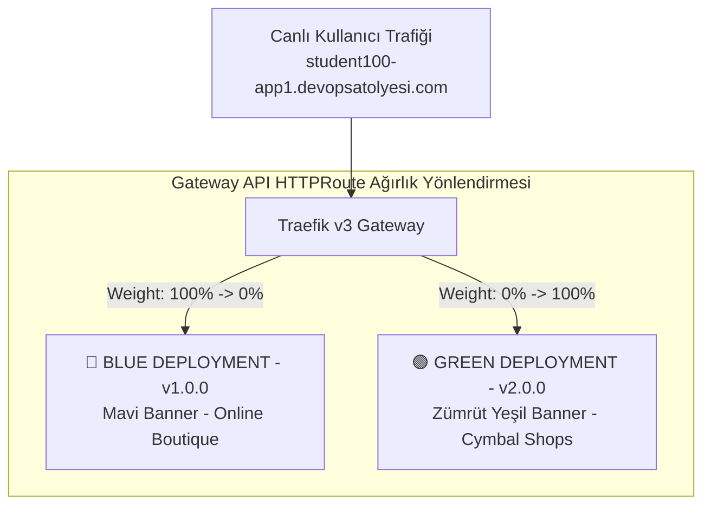

# 🔵🟢 Kubernetes Gateway API ile Blue-Green Dağıtım Laboratuvarı
### Google Online Boutique — Zero Downtime Traffic Shifting & Instant Rollback

Bu laboratuvar, modern mikroservis mimarilerinde sıfır kesinti (**Zero-Downtime Deployment**) ve anında geri alma (**Instant Rollback**) operasyonlarının **Kubernetes Gateway API (Traefik v3)** ile nasıl yönetildiğini uygulamalı olarak öğretir.

---

## 🏛️ Mimari Tasarım & Görsel Farklılaşma

Blue-Green stratejisinde iki bağımsız sürüm aynı kümede yan yana çalışır. Dış dünyadan gelen canlı trafik Traefik Gateway üzerindeki `weight` (ağırlık) parametresiyle yönlendirilir:



### 🎨 İki Sürüm Arasındaki Görsel Farklar

Öğrencilerin trafik geçişini gözleriyle net görebilmesi için iki sürüme özel tasarımlar yapılmıştır:

| Özellik | 🔵 Blue Version (Mevcut Canlı / Prod) | 🟢 Green Version (Yeni Sürüm / Staging) |
|---|---|---|
| **Sürüm Numarası** | `v1.0.0` | `v2.0.0` |
| **Üst Banner Rengi** | 🟦 **Kraliyet Mavisi (`#1a73e8`)** | 🟩 **Zümrüt Yeşili (`#059669`)** |
| **Banner Başlığı** | `🔵 [BLUE VERSION — PRODUCTION] v1.0.0` | `🟢 [GREEN VERSION — NEXT-GEN STORE] v2.0.0` |
| **Marka & Tema** | Google Online Boutique (Klasik) | Cymbal Modern Shops (Yeni Nesil Tasarım) |
| **Hedef Servis Adı** | `frontend-blue:80` | `frontend-green:80` |

---

## 🚀 Laboratuvar Uygulaması

### Yol A: Jenkins Parameterized Pipeline ile (Tek Tıkla Otomasyon)

1. Jenkins panelinizi açın: `https://student<ID>-jenkins.devopsatolyesi.com`
2. Dashboard'da bulunan **`Online-Boutique-Blue-Green-Switch`** işine tıklayın.
3. Sol menüden **"Build with Parameters"** butonuna basın.
4. **STRATEGY** açılır kutusundan istediğiniz senaryoyu seçin:
   * 🟢 **`GREEN (100% Green - Cutover to New Version)`**: Tüm canlı trafiği yeni yeşil sürüme aktarır.
   * 🔵 **`BLUE (100% Blue - Instant Rollback)`**: Bir hata anında 1 saniyede eski mavi sürüme geri döner.
   * ⚖️ **`CANARY (80% Blue / 20% Green)`**: Trafiği %80 Mavi, %20 Yeşil olarak paylaştırır.
5. **Build** butonuna basın.
6. Pipeline 4 aşamayı icra eder:
   * **1. Validate Kubernetes & Gateway API:** Küme ve Traefik kontrolü.
   * **2. Apply Traffic Routing Strategy:** `HTTPRoute` nesnesindeki `weight` değerlerini günceller.
   * **3. Smoke Test & Health Check:** Rota geçişinden sonra `200 OK` doğrulaması yapar.
   * **4. Annotate Grafana Timeline:** Grafana grafiğinin üstüne canlı dikey çizgi çeker.
7. Tarayıcınızda mağazayı açın ve yenileyin: **`https://student<ID>-app1.devopsatolyesi.com`**  
   * Sayfa yenilendiğinde **üst banner'ın anında masmavi renkten zümrüt yeşiline döndüğünü** göreceksiniz!

---

### Yol B: Terminalden kubectl ile (Manuel / Mühendis Yöntemi)

Eğer komut satırından Gateway API YAML nesnelerini doğrudan yönetmek isterseniz:

```bash
cd ~/ecommerce-kind-gateway-cicd

# 1. Blue ve Green sürümlerini kümeye deploy edin:
kubectl apply -f gateway-api/blue-green/01-blue-green-services.yaml

# 2. Podların çalıştığını doğrulayın:
kubectl get pods -l app=frontend-blue
kubectl get pods -l app=frontend-green

# 3. Trafiği %100 GREEN sürümüne geçirin:
cat << 'EOF' | kubectl apply -f -
apiVersion: gateway.networking.k8s.io/v1
kind: HTTPRoute
metadata:
  name: frontend-route
  namespace: default
spec:
  parentRefs:
    - name: traefik-gateway
      namespace: traefik
      sectionName: web
  hostnames:
    - "student100-app1.devopsatolyesi.com"
    - "localhost"
    - "127.0.0.1"
  rules:
    - matches:
        - path:
            type: PathPrefix
            value: /
      backendRefs:
        - name: frontend-blue
          port: 80
          weight: 0
        - name: frontend-green
          port: 80
          weight: 100
EOF

# 4. Doğrulayın (HTTP yanıtı 200 döner ve yeşil sürüm yanıt verir):
curl -s -I https://student100-app1.devopsatolyesi.com/ | head -n 5
```

---

## 📊 Grafana'da Trafik Geçişini İzleme

1. Açın: `https://student<ID>-grafana.devopsatolyesi.com`
2. **Online Boutique — Full Stack Monitoring Dashboard** panelini açın.
3. Jenkins'ten geçiş yaptığınız saniyede:
   * Grafiğin üzerinde mor renkli dikey bir **Annotation (İşaret)** belirecektir:  
     `📍 Traffic Shift: GREEN (100% Green)`
   * İsteklerin sıfır hata ile yeni konteyner kümesine aktığını eş zamanlı olarak gözlemleyebilirsiniz.

---

## 🛡️ Anında Geri Alma (Instant Rollback) Testi

1. Yeni yeşil sürümde beklenmedik bir hata tespit ettiğinizi varsayın.
2. Jenkins'te tekrar **Build with Parameters** deyin ve **`BLUE (100% Blue - Instant Rollback)`** seçip çalıştırın.
3. `https://student100-app1.devopsatolyesi.com` adresini yenileyin.
4. **Tek bir saniye dahi kesinti olmadan** anında önceki stabil mavi sürüme döndüğünüzü gözlemleyin.
