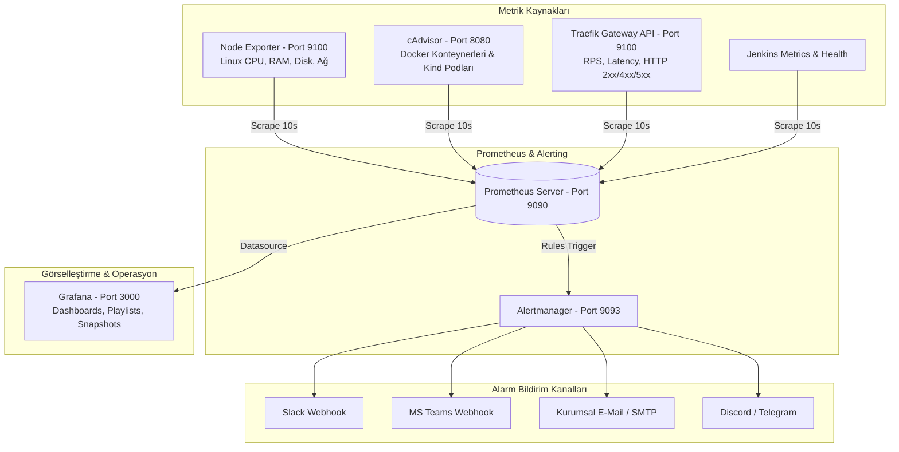

# 📊 Enterprise Monitoring & Observability Guide
### Prometheus, Alertmanager, Grafana, cAdvisor & Node Exporter

Bu kılavuz, **Google Online Boutique** platformu için kurulan tam teşekküllü kurumsal gözlemlenebilirlik (observability) altyapısının tüm özelliklerini, alarm kanallarını (Slack, Teams, Mail) ve Grafana'nın ileri düzey yeteneklerini (**Playlists**, **Snapshots**, **Annotations**, **Log Entegrasyonu**) uygulamalı olarak öğretir.

---

## 🏗️ Gözlemlenebilirlik Mimarisi



---

## 🚨 1. Alarmlar Nereye Gönderilir? (Slack, Teams, E-Mail, Discord)

Prometheus'un tespit ettiği anomaliler **Alertmanager** üzerinden farklı kanallara dağıtılır. `monitoring/alertmanager/config.yml` dosyasını düzenleyerek istediğiniz kanalı bağlayabilirsiniz:

### A) Slack Entegrasyonu (En Popüler DevOps Standardı)
Slack'te bir **Incoming Webhook** oluşturun ve Alertmanager yapılandırmasına ekleyin:

```yaml
global:
  resolve_timeout: 5m

route:
  group_by: ['alertname', 'severity']
  group_wait: 10s
  group_interval: 10s
  repeat_interval: 1h
  receiver: 'slack-notifications'

receivers:
  - name: 'slack-notifications'
    slack_configs:
      - api_url: 'https://hooks.slack.com/services/REPLACE_WITH_YOUR_SLACK_WEBHOOK'
        channel: '#devops-alerts'
        send_resolved: true
        title: '🚨 [{{ .Status | toUpper }}] {{ .CommonLabels.alertname }}'
        text: >-
          *Özet:* {{ .CommonAnnotations.summary }}
          *Detay:* {{ .CommonAnnotations.description }}
          *Önem Derecesi:* `{{ .CommonLabels.severity }}`
```

### B) Microsoft Teams Entegrasyonu
Teams kanalında **Incoming Webhook** bağlayıcısı (Connector) açın:

```yaml
receivers:
  - name: 'teams-notifications'
    webhook_configs:
      - url: 'https://outlook.office.com/webhook/xxxxxx/IncomingWebhook/yyyyyy'
        send_resolved: true
```

### C) E-Mail (SMTP / Gmail / AWS SES) Entegrasyonu
Kritik sistem çökmelerinde nöbetçi mühendise e-posta göndermek için:

```yaml
global:
  smtp_smarthost: 'smtp.gmail.com:587'
  smtp_from: 'alerts@devopsatolyesi.com'
  smtp_auth_username: 'alerts@devopsatolyesi.com'
  smtp_auth_password: 'uygulama_sifresi'

receivers:
  - name: 'email-notifications'
    email_configs:
      - to: 'oncall-devops@firma.com'
        send_resolved: true
        headers:
          Subject: '🚨 [Kritik Alarm] {{ .CommonLabels.alertname }}'
```

---

## 📺 2. Grafana İleri Düzey Özellikleri: Playlist, Snapshot & Annotations

### A) Playlist (NOC & TV Modu) Nedir ve Nasıl Yapılır?
**Nedir?** Ofislerdeki veya Operasyon Merkezlerindeki (NOC) büyük ekranlarda birden fazla dashboard'un insan müdahalesine gerek kalmadan belirli saniye aralıklarıyla (örn: her 10 saniyede bir) otomatik sırayla dönmesini sağlar.

#### 🌐 Arayüzden Nasıl Yapılır?
1. Grafana sol menüsünden **Dashboards ➔ Playlists** sekmesine tıklayın.
2. Sağ üstteki **"New playlist"** butonuna basın.
3. **Name:** `DevOps NOC Screen` yazın.
4. **Interval:** `10s` (veya `30s`) seçin.
5. Listeden eklemek istediğiniz dashboard'ları seçin:
   * *Online Boutique — Full Stack Monitoring*
   * *Traefik Gateway API Overview*
   * *Host & Kubernetes Node Resources*
6. **Save** deyin.
7. Oynatmak için **Start playlist** butonuna basın ➔ **TV Mode** veya **Kiosk Mode** seçtiğinizde tam ekran olarak paneller sırayla otomatik kayar.

---

### B) Snapshot (Olay Anı Fotoğrafı / Post-Mortem) Nedir ve Nasıl Yapılır?
**Nedir?** Canlı dashboard'lar zaman geçtikçe eski veriyi kaybedebilir. Bir çökme, yavaşlama veya güvenlik ihlali olduğunda, **o anki grafik verisini dondurup** statik bir kopya (fotoğraf) halinde ekip arkadaşlarınızla veya yöneticinizle paylaşabileceğiniz kalıcı bir web bağlantısı üretir.

#### 🌐 Arayüzden Nasıl Yapılır?
1. İncelediğiniz Grafana Dashboard'unun sağ üst köşesindeki **Paylaş (Share)** simgesine tıklayın.
2. Açılan pencerede **Snapshot** sekmesini seçin.
3. **Snapshot name:** `Incident-2026-HighLatency-Case` yazın.
4. **Expire:** `Never` veya `7 days` belirleyin.
5. **Publish to snapshots.raintank.io** (veya yerel **Local Snapshot**) butonuna basın.
6. Size verilen özel bağlantı linkini kopyalayıp Slack/Jira biletine ekleyin. Bu linki açan herkes veritabanına bağlanmadan o anki grafiği interaktif olarak inceler.

---

### C) Annotations (Dağıtım İşaretleri) Nedir?
**Nedir?** "Sistem neden saat 14:15'te yavaşladı?" sorusunun cevabını grafikte dikey bir çizgiyle işaretlemektir. Jenkins boru hattı her deploy tamamladığında Grafana API'sine küçük bir POST isteği atar ve grafiğin üzerine şu not düşülür:
`🚀 Build #12 deployed by Jenkins (Commit: a4484ba)`

#### 💻 Jenkinsfile ile Otomatik Annotation Ekleme:
```groovy
stage('Annotate Grafana') {
    steps {
        sh """
            curl -s -u admin:BilgincIT454 -X POST http://training-grafana:3000/api/annotations \
              -H "Content-Type: application/json" \
              -d '{"time": ${System.currentTimeMillis()}, "text": "Deployment: Online Boutique Build #${BUILD_NUMBER}", "tags": ["deployment", "jenkins"]}'
        """
    }
}
```

---

## 🪵 3. Jenkins Logları Grafana'ya Gelebilir mi? (Saçma mı, Zirve mi?)

**Kesinlikle saçma DEĞİL; bu, kurumsal seviyede bir DevOps standardıdır!**

Buna **"Grafana Loki + Promtail"** log yığını denir. 
* Metrikler (Prometheus) bize **"Ne zaman ve nerede hata oldu?"** sorusunu söyler.
* Loglar (Loki) ise **"Neden hata oldu?"** sorusunu cevaplar.

Grafana'da **Explore** sekmesine girdiğinizde üstte Traefik HTTP 500 hata grafiğini, hemen altında ise Jenkins derleme loglarını ve Kubernetes pod'larının hata stack-trace loglarını aynı ekranda yan yana görebilirsiniz.

### Basit Log Toplama Mimarisi:
* Sunucuya hafif bir **Promtail** konteyneri eklenir.
* Promtail, `/var/jenkins_home/jobs/**/builds/**/log` ve `/var/lib/docker/containers/**` dosyalarını okur.
* Logları **Loki**'ye indeksler ve Grafana'da aranabilir hale getirir.

---

## 🖥️ 4. Grafana Panelini Sıfırdan Manuel Olarak Nasıl Yaparız? (Adım Adım)

Eğer hazır JSON kullanmak yerine kendi özel panelinizi oluşturmak isterseniz:

1. Grafana ana sayfadan **Dashboards ➔ New ➔ New Dashboard** deyin.
2. **Add visualization** butonuna tıklayın.
3. Veri kaynağı olarak **Prometheus**'u seçin.
4. **Query (Sorgu)** kısmına PromQL sorgunuzu yazın:
   * **İstek Hızı (RPS):** `sum(rate(traefik_entrypoint_requests_total[1m])) by (entrypoint)`
   * **HTTP 5xx Hata Yüzdesi:** `(sum(rate(traefik_entrypoint_requests_total{code=~"5.*"}[5m])) / sum(rate(traefik_entrypoint_requests_total[5m]))) * 100`
   * **Konteyner RAM:** `sum(container_memory_working_set_bytes{name=~".*boutique.*"}) by (name)`
   * **Sunucu RAM Yüzdesi:** `(1 - (node_memory_MemAvailable_bytes / node_memory_MemTotal_bytes)) * 100`
5. Sağ taraftaki panel ayarlarından:
   * **Panel type:** `Time series` veya `Stat` veya `Gauge` seçin.
   * **Unit:** `requests/sec (reqps)` veya `bytes` veya `percent (0-100)` belirleyin.
   * **Title:** Panel başlığını girin.
6. Sağ üstteki **Apply** butonuna basın ve dashboard'unuzu **Save** diyerek kaydedin.

---

## 🔄 5. Jenkins Otomatik 5 Dakikalık Deploy Tetikleyicisinin İptali

Jenkins as Code (`jenkins.yaml`) dosyasında daha önce bulunan `scm('H/5 * * * *')` Git yoklama tetikleyicisi kaldırılmıştır. 

Artık sistem:
* Sadece öğrenci Jenkins arayüzünden **"Build Now"** butonuna bastığında veya
* GitHub'a yeni bir kod push edildiğinde (Webhook) çalışır.
* Kendi kendine gereksiz yere her 5 dakikada bir sunucuyu yormaz ve deploy yapmaz.
